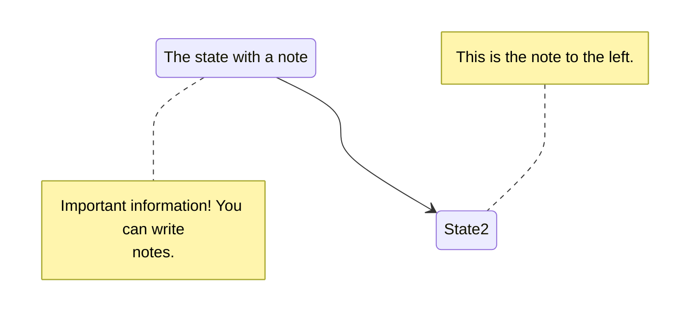

+++
date = '2026-04-08T12:03:40+02:00'
title = 'Shortcodes'
banner = "img/banners/banner-Hugo.jpg"
summary = "Esta página web pretende comprobar cómo funcionan los shortcodes que he visto en el tema Hugo - Book"
authors = ["jescudero"]
mermaid = true
asciinema = true
+++

### Asciinema




### Diagramas con Mermaid
```txt
``mermaid
stateDiagram-v2
    State1: The state with a note
    note right of State1
        Important information! You can write
        notes.
    end note
    State1 --> State2
    note left of State2 : This is the note to the left.
``
```




