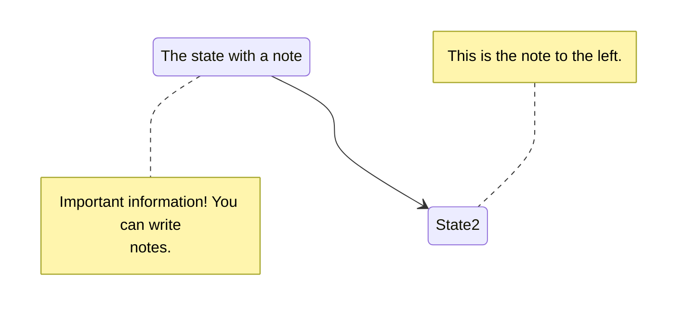

+++
date = '2026-04-08T12:03:40+02:00'
title = 'Shortcodes'
banner = "img/banners/banner-Hugo.jpg"
summary = "Esta página web pretende comprobar cómo funcionan los shortcodes que he visto en el tema Hugo - Book"
authors = ["jescudero"]
mermaid = true
asciinema = true
steps = true
+++

Los shortcodes son pequeñas etiquetas o fragmentos especiales que te permiten insertar contenido dinámico o componentes más complejos dentro de un archivo Markdown de forma sencilla. Son etiquetas personalizadas que el generador estático interpreta y reemplaza por HTML (u otro contenido) en el proceso de build.

Los shortcodes son uno de los aspectos más avanzados y complejos de HUGO, si no tiene conocimientos deberá auxiliarlo su IA favorita.

### Asciinema




### Diagramas con Mermaid
```txt
``mermaid
stateDiagram-v2
    State1: The state with a note
    note right of State1
        Important information! You can write
        notes.
    end note
    State1 --> State2
    note left of State2 : This is the note to the left.
``
```



### Paso a Paso

```html

{{ % steps %}}
1. ## Suspendisse sed congue orci.

    Suspendisse sed congue orci, eu congue metus. Nullam feugiat urna massa, et fringilla metus consectetur molestie. Curabitur pellentesque sodales ipsum, sed efficitur libero euismod ac.

2. ## Maecenas scelerisque sem.

    Maecenas scelerisque sem a tellus dignissim, in sodales neque varius. Integer quis ex quis sem posuere consequat. Morbi interdum ex et mollis maximus. Proin sed quam nisl.

3. ## Etiam risus purus.

    Etiam risus purus, suscipit a orci quis, mollis mollis ante. Vestibulum congue nisl malesuada tortor egestas, a lobortis tellus dictum. Nam nec ultrices justo.

4. ## Curabitur sed lacinia velit.

    Curabitur sed lacinia velit. Nullam sed ante non quam lobortis hendrerit. Phasellus elementum, erat sit amet imperdiet pulvinar, odio massa lobortis ipsum, in tincidunt metus dolor vel ligula.

{{ % /steps %}}

```

{}
1. ## Suspendisse sed congue orci.

    Suspendisse sed congue orci, eu congue metus. Nullam feugiat urna massa, et fringilla metus consectetur molestie. Curabitur pellentesque sodales ipsum, sed efficitur libero euismod ac.

2. ## Maecenas scelerisque sem.

    Maecenas scelerisque sem a tellus dignissim, in sodales neque varius. Integer quis ex quis sem posuere consequat. Morbi interdum ex et mollis maximus. Proin sed quam nisl.

3. ## Etiam risus purus.

    Etiam risus purus, suscipit a orci quis, mollis mollis ante. Vestibulum congue nisl malesuada tortor egestas, a lobortis tellus dictum. Nam nec ultrices justo.

4. ## Curabitur sed lacinia velit.

    Curabitur sed lacinia velit. Nullam sed ante non quam lobortis hendrerit. Phasellus elementum, erat sit amet imperdiet pulvinar, odio massa lobortis ipsum, in tincidunt metus dolor vel ligula.

{}


### Referencias

- Los contenidos de este post están fuertemente inspirados en los shortcodes que se muestran en el tema Hugo Book.